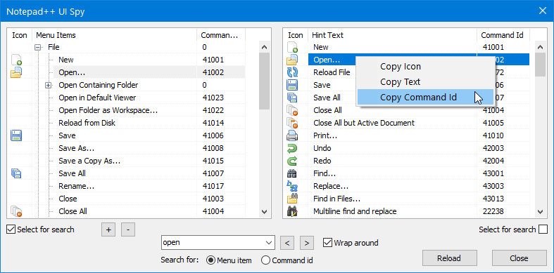

# NppUISpy plugin for Notepad++

Builds for 32 and 64 bits Notepad++ installations available

Author: Andreas Heim, 2018

# Features

With this plugin you can explore the main menu structure and the toolbar of Notepad++ to figure out which menu command ids are assigned to menu items and toolbar buttons.

You can left-click on menu item and toolbar button entries to execute the related command. With a right-click to the items a context menu pops up where you can select to copy the item text or its menu command id to the clipboard.

Both the menu item tree and the toolbar button list provide full-text search. Start typing while one of them is focused to make the first matching item getting highlighted.

# Manual installation

1. Download the latest release. If you run a 32 bits version of Notepad++ take the file "NppUISpy_vX.X_UNI.zip". In case of a 64 bits version take the file "NppUISpy_vX.X_x64.zip".
2. Unzip the downloaded file to a folder on your harddisk where you have write permissons.

The following steps depend on the version of Notepad++ you use.

#### Notepad++ versions prior to v7.6

1. Copy the file "NppUISpy.dll" to the "plugins" directory of your Notepad++ installation. You can find the "plugins" directory under the installation path of Notepad++.
2. Copy the file "doc\NppUISpy.txt" to the directory "plugins\doc". If it doesn't exist create it.

#### Notepad++ version v7.6

1. Under "%UserProfile%\AppData\Local\Notepad++\plugins" create a directory "NppUISpy" and copy the file "NppUISpy.dll" to this directory.
2. Under "%UserProfile%\AppData\Local\Notepad++\plugins\NppUISpy" create a directory "doc" and copy the file "doc\NppUISpy.txt" to this directory.

#### Notepad++ versions subsequent to v7.6
1. Under "%ProgramData%\Notepad++\plugins" create a directory "NppUISpy" and copy the file "NppUISpy.dll" to this directory.
2. Under "%ProgramData%\Notepad++\plugins\NppUISpy" create a directory "doc" and copy the file "doc\NppUISpy.txt" to this directory.

# History

v1.0.2 - December 2018
- enhanced: Added toolbar icon.

v1.0.1 - December 2018
- fixed: Sometimes Command Id column of menu entries tree shows invalid content.
- enhanced: Both menu item tree and toolbar button list provide a context menu to copy the selected element's text or menu command id to clipboard.

v1.0 - December 2018
- Initial version
